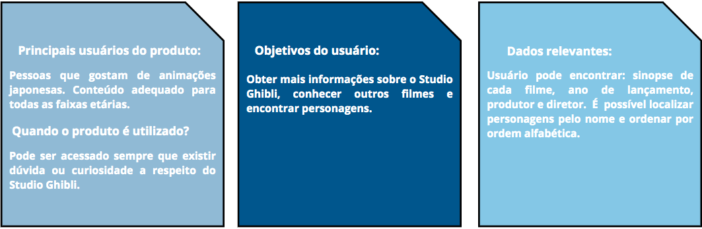
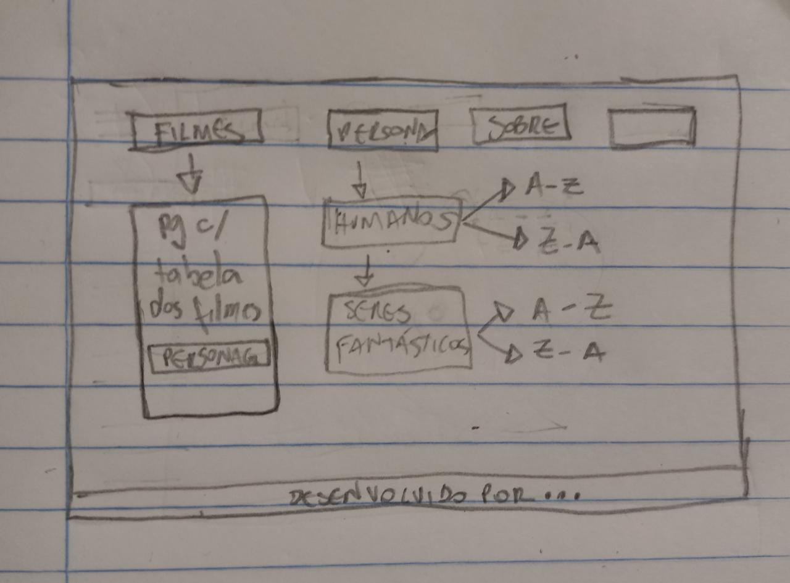
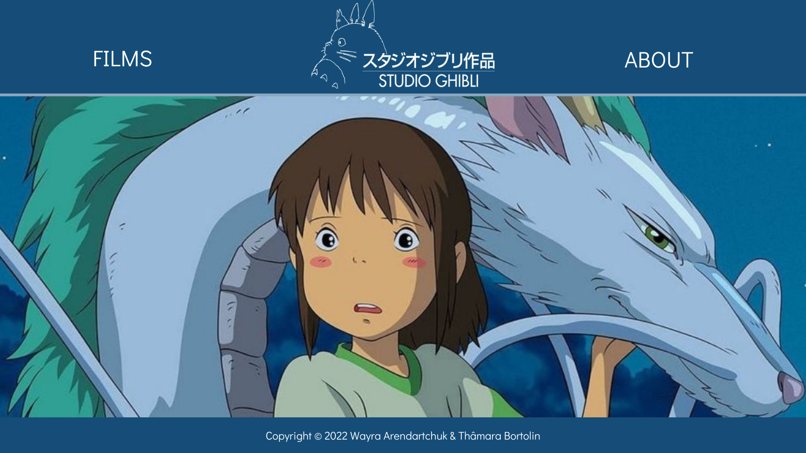
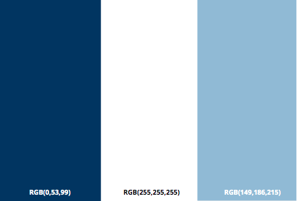

# Studio Ghibli-Data Lovers

## Índice

- [1. O que é o projeto?](#1-o-que-é-o-projeto-?)
- [2. História de usuário](#2-história-de-usuário)
- [3. Protótipos da página](#3-protótipos-da-página)
- [4. Critérios de aceitação do projeto](#4-critérios-de-aceitação-projeto)
- [5. Desenvolvedoras](#5-desenvolvedoras)

---

## 1. O que é o projeto?

Este é o segundo projeto proposto pelo Bootcamp Laboratória geração 007. A partir de um banco de dados que
contém informações sobre o Studio Ghibli, o foco desta página web é facilitar a obtenção de informações que o usuário necessite, como por exemplo: pesquisar por nomes de filmes, nomes de pesonagems e organizar por ordem alfabética.
O Studio Ghibli, é conhecido mundialmente por conta da qualidade de seus filmes de animação. Esta página proporciona ao usuário detalhes sobre os filmes e personagens, além de conter uma espaço dedicado a história do Studio Ghibli. Aproveite!

## 2. História de usuário

Este espaço é dedicado ao entendimento de quem será o usuário final. Utilizamos algumas perguntas chave, para assim definir qual o propósito da página web e utilizar as respostas como  guia  para o desenho dos protótipos de baixa e alta fidelidade.

## 3. Protótipos da página

Prótotipo de baixa fidelidade:

Protótipo de alta fidelidade:

Paleta de cores utilizada:

## 4. Critérios de aceitação do projeto

Definição de produto;
História de usuário;
Protótipo de alta e baixa fidelidade;
Testes de usabilidade;
Implementação da interface de usuário (HTML/CSS/JS);
Testes unitários.

No mínimo, a implementação deverá:

1. Mostrar os dados em uma interface: pode ser em cards, tabelas, listas, etc.
2. Permitir ao usuário interagir com a interface para obter as informações que
   necessita;
3. Ser _responsiva_, ou seja, deve ser visualizada sem problemas a partir de
   diversos tamanhos de tela: celulares, tablets, notebooks, etc.
4. Que a interface siga os fundamentos de _visual design_.

## 5. Desenvolvedoras

Este projeto foi desenvolvido por Thâmara Bortolin e Wayra Arendartchuk Castro, alunas da sétima geração do BootCamp Laboratória/BR.
